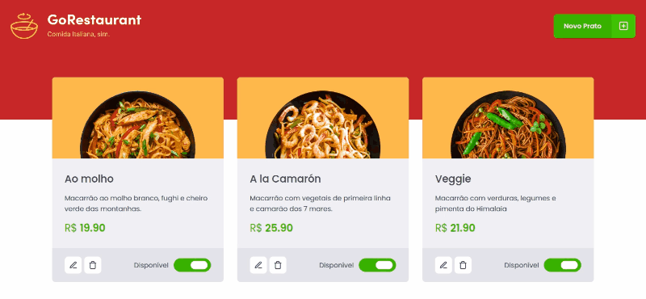

<h1 align="center">
 
  
 
 
Go Restaurant
</h1>

Projeto de um painel de administração para resutarantes controlarem os pratos do estabelecimento. Com o foco de treinar CRUD, TypeScript e isolamento de componentes onde cada um tem uma função específica.

  

  
Adicionando prato
   

  
Layout responsivo
  

## Recursos usados:
[//]: # (Add the features of your project here:)

- ⚛️ **React Js**
- 💹 **Node Js**
- ʦ   **TypeScript**
- 🃏  **Jest**

## Começando

1.  Clone este repositório usando git clone `https://github.com/MatheusPetry/gorestaurant-web.git`
2.  Vá para o diretório apropriado: `cd gorestaurant-web`
3.  Execute `yarn` para instalar dependência

## Inicializando o aplicativo
1.  Vá para a pasta: `cd gorestaurant-web`
2.  Execute `yarn json-server server.json` para iniciar a API Fake
3.  Execute `yarn start` para iniciar o aplicativo da web

## Licença

Este projeto está licenciado sob a Licença MIT - consulte a página [LICENSE](https://opensource.org/licenses/MIT) para obter detalhes.

